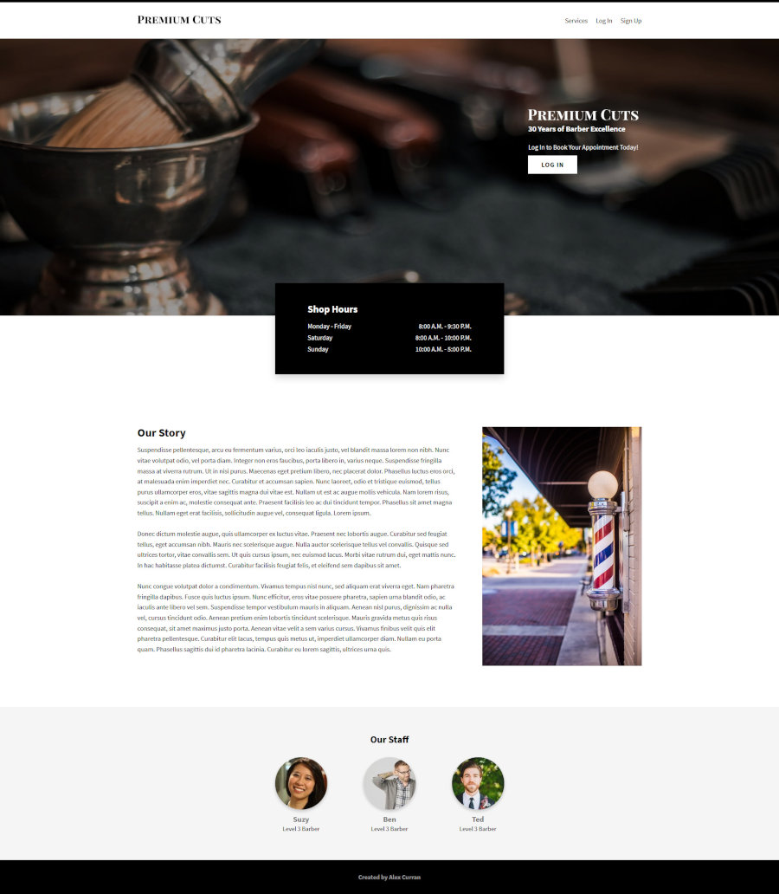
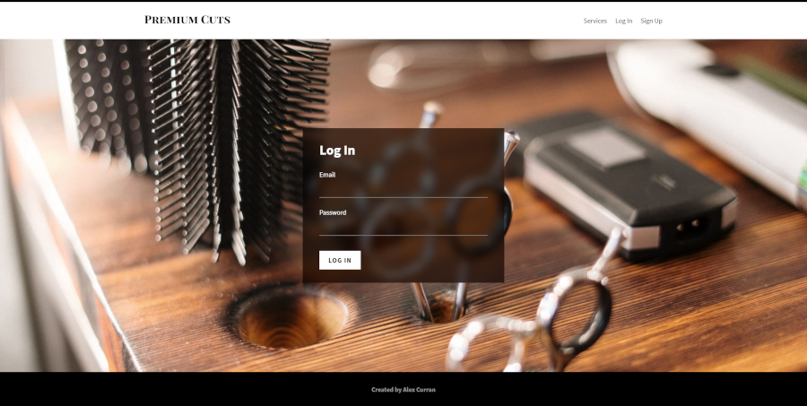
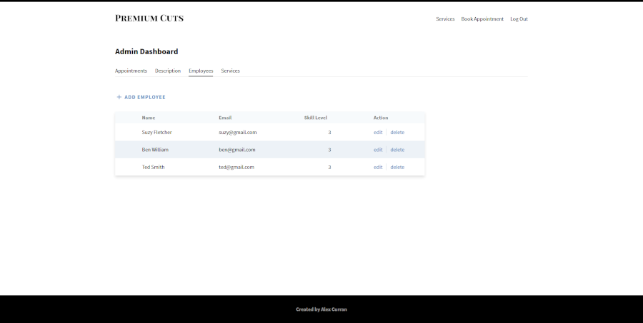
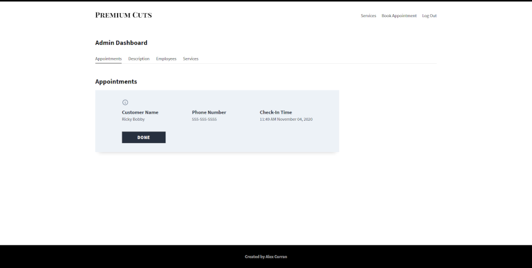
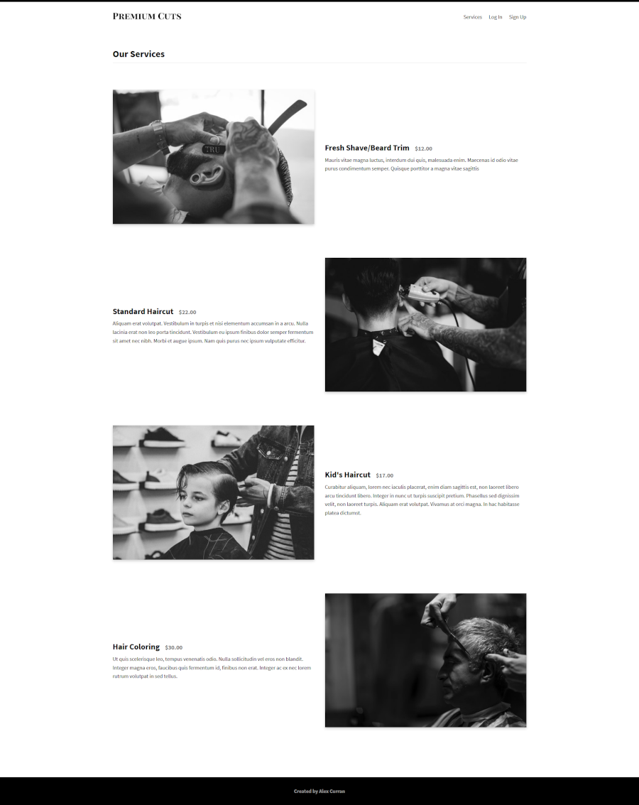

# Barber Shop

[View live site](https://premium-cuts.currandev.com)

## Features:

- Utilizes an Express back-end, with a PostgreSQL database

- CRUD operations supported for admins when working with employees, services, or "about" description

- Admin-restricted routes with JWT

- Authenticated user-restricted routes with JWT

- Logged in users may book appointments

- Admins can view/delete live user appointments in an interactive dashboard

- Live WebSockets notifications created with the Socket.io package

- React front-end with Redux providing state management (Redux-Thunk for async API calls)

- bcrypt used for password hashing

- joi package used for data validation

- Animations provided by framer-motion

- Date formatting with modern Intl.DateTimeFormat API

- :test_tube: E2E testing with Cypress.io

